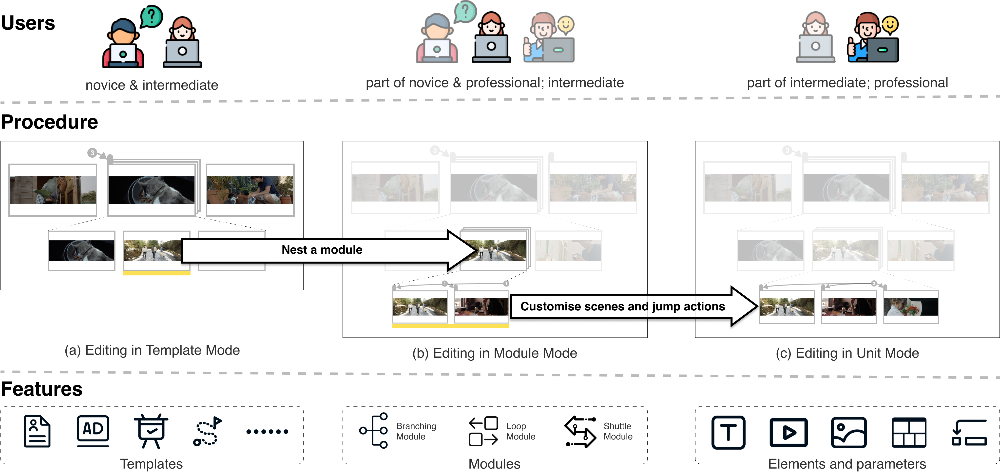

# HierVid: Lowering the Barriers to Entry of Interactive Video Making with a Hierarchical Authoring System

Code of paper *HierVid: Lowering the Barriers to Entry of Interactive Video Making with a Hierarchical Authoring System.*



# Usage

```
npm i
npm start
```

# Deployment

1. The system uses WebDav as the storage. Assume that your WebDav server is http://a.com/, you need to modify proxy option at package.json (development) or use nginx to proxy /api request to your WebDav server (production)
2. Compile: `npm run build`, the output is at /build directory
